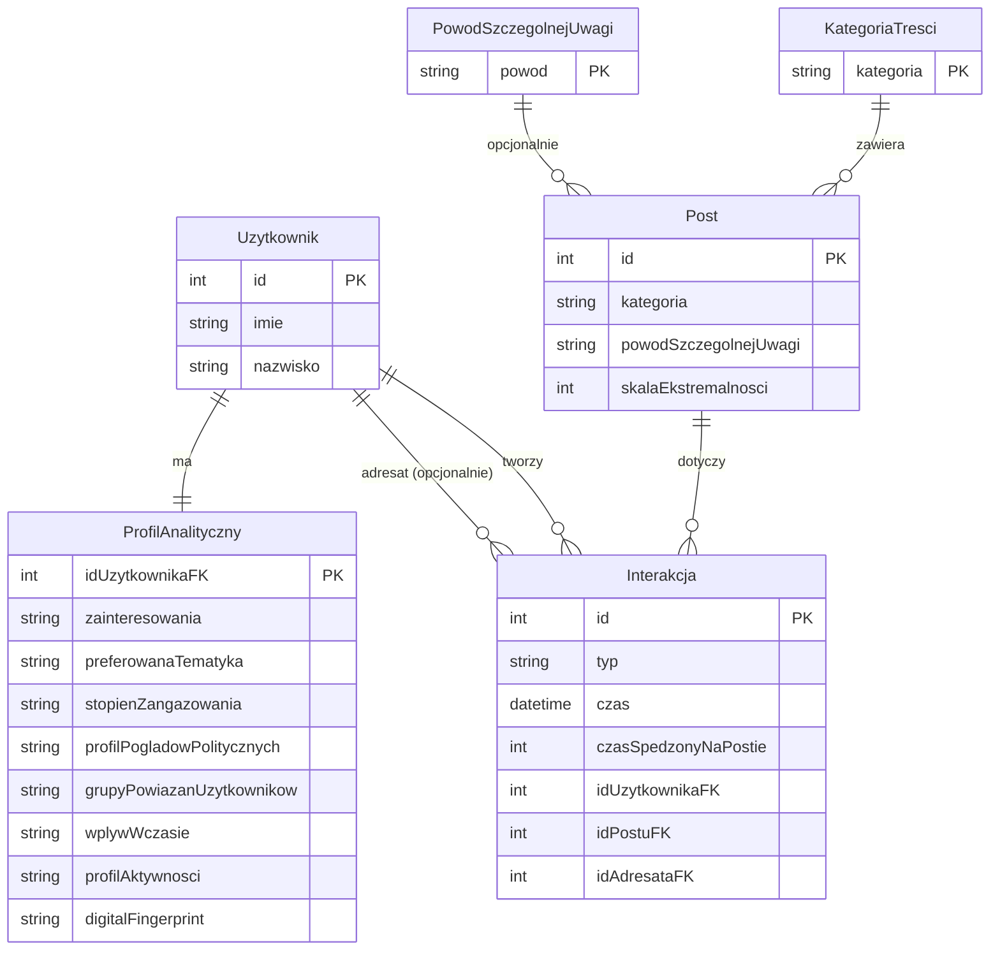

# PEGASUS – Projekt bazy danych

System baz danych:

- **PEGASUS** — System Analizy Behawioralnej Platformy Społecznościowej

Działający na Oracle 21c (lokalnie przez Docker XE, produkcyjnie przez Oracle Autonomous Database).

---

## Tech Stack

<div align="center">

         

</div>

---

## Struktura projektu

```
.
├── setup.ps1                   ← jednoklokowe wdrożenie Windows (PEGASUS + OBDN)
├── setup.sh                    ← jednoklokowe wdrożenie Linux/macOS (PEGASUS + OBDN)
├── docker-compose.yml          ← Oracle XE + CloudBeaver
│
└── pegasus/
    ├── analysis/
    │   ├── Analiza biznesowa UML.md
    │   ├── Algorytm analizy behawioralnej UML.md
    │   ├── Model ERD.md
    │   └── PEGASUSownik.md
    ├── diagrams/
    │   ├── 01_use_case.puml
    │   ├── 02_activity_profile_calc.puml
    │   ├── 03_activity_user_interaction.puml
    │   ├── 04_state_user.puml
    │   └── 05_erd.puml
    ├── sql/
    │   ├── 00_setup_schema.sql           ← użytkownik PEGASUS (lokalnie / XE)
    │   ├── 01_create_tables.sql
    │   ├── 02_insert_test_data.sql
    │   ├── 03_views_and_procedures.sql
    │   └── 04_demo_data.sql
    └── tests/
        ├── test_database.py
        └── requirements.txt
```

---

## PEGASUS — System Analizy Behawioralnej

Moduł analityczny osadzony w istniejącej platformie społecznościowej. Zbiera dane o interakcjach użytkowników z treściami (polubienia, komentarze, udostępnienia, czas oglądania) i buduje automatycznie profil behawioralny każdego użytkownika:

- preferowana tematyka treści,
- wskaźnik zaangażowania,
- profil poglądów politycznych,
- ekspozycja na treści ekstremistyczne,
- potencjalne grupy powiązań między użytkownikami (klastry).

### Model ERD (PEGASUS)



### Tabele (PEGASUS)

| Tabela                      | Opis                                                        |
| --------------------------- | ----------------------------------------------------------- |
| `ROLES`                     | Role użytkowników (`Admin`, `UzytkownikWidok`)              |
| `POST_CATEGORIES`           | Słownik kategorii treści (z flagą polityczną i kierunkiem)  |
| `SPECIAL_ATTENTION_REASONS` | Słownik powodów szczególnej uwagi (skala 1–5)               |
| `USERS`                     | Użytkownicy (imię, nazwisko, e-mail, status, rola)          |
| `POSTS`                     | Posty (autor, kategoria, powód uwagi, skala ekstremalności) |
| `LIKES`                     | Polubienia (user → post, czas spędzony)                     |
| `COMMENTS`                  | Komentarze (user → post, treść, czas spędzony)              |
| `SHARES`                    | Udostępnienia (from_user → post → to_user, czas spędzony)   |
| `POST_VIEWS`                | Sesje oglądania postów (czas start/end)                     |
| `USER_PROFILES`             | Profile behawioralne użytkowników (1:1 z `USERS`)           |

### Widoki (PEGASUS)

| Widok                       | Opis                                                                        |
| --------------------------- | --------------------------------------------------------------------------- |
| `V_USER_ACTIVITY`           | Sumaryczna aktywność użytkownika (lajki, komentarze, udostępnienia, widoki) |
| `V_USER_PREFERRED_CATEGORY` | Top-1 preferowana kategoria (ważone: lajk×1, komentarz×3, udostępnienie×2)  |
| `V_USER_POLITICAL_EXPOSURE` | Ekspozycja polityczna (LEFT / RIGHT / CENTER / EXTREMIST)                   |
| `V_FLAGGED_POSTS`           | Treści szczególnej uwagi (dla administratora)                               |
| `V_USER_FULL_PROFILE`       | Pełny profil behawioralny użytkownika (dla admina)                          |
| `V_MY_INTERACTIONS`         | Interakcje zalogowanego użytkownika                                         |

### Procedury (PEGASUS)

| Procedura                              | Opis                                                                                                                                                              |
| -------------------------------------- | ----------------------------------------------------------------------------------------------------------------------------------------------------------------- |
| `SP_CALCULATE_USER_PROFILE(p_user_id)` | Przelicza i zapisuje do `USER_PROFILES`: engagement score, profil aktywności, preferred category, political lean, extremism exposure, digital fingerprint SHA-256 |
| `SP_CALCULATE_ALL_PROFILES`            | Wywołuje `SP_CALCULATE_USER_PROFILE` dla wszystkich aktywnych użytkowników                                                                                        |
| `SP_BUILD_SOCIAL_CLUSTERS`             | Grupuje użytkowników w klastry społeczne na podstawie wspólnych kategorii                                                                                         |

---

## Uruchamianie lokalnie (Docker + Oracle XE)

### Wymagania

- [Docker Desktop](https://www.docker.com/products/docker-desktop/) (Windows / macOS / Linux)

### Szybki start (jeden klik)

**Windows (PowerShell):**

```powershell
.\setup.ps1
```

**Linux / macOS (bash):**

```bash
bash setup.sh
```

Skrypt automatycznie:

1. Uruchamia kontener Oracle XE i CloudBeaver,
2. Czeka na gotowość bazy (do 5 minut),
3. Tworzy schemat `PEGASUS` → ładuje wszystkie skrypty SQL,

Hasła są generowane losowo przy pierwszym uruchomieniu i zapisywane do `.env`:

```
ORACLE_PASSWORD=<hasło SYS>
PEGASUS_PASSWORD=<hasło użytkownika PEGASUS>
```

Opcje:

| Flaga / opcja               | Opis                                   |
| --------------------------- | -------------------------------------- |
| `-Reset` / `--reset`        | Usuwa i odtwarza oba schematy od zera  |
| `-SkipData` / `--skip-data` | Tylko DDL, bez danych testowych i demo |

### Dane połączenia

| Parametr     | Wartość                                 |
| ------------ | --------------------------------------- |
| Host         | `localhost`                             |
| Port         | `1522`                                  |
| Service name | `XEPDB1`                                |
| Użytkownik   | `PEGASUS`                               |
| Hasło        | _(wartość `PEGASUS_PASSWORD` z `.env`)_ |

### Panel administracyjny (CloudBeaver)

Po uruchomieniu: **http://localhost:8978**

Pierwsze uruchomienie poprosi o założenie lokalnego konta admina.  
Następnie dodaj dane połączenia:

| Parametr     | PEGASUS                     |
| ------------ | --------------------------- |
| Driver       | Oracle                      |
| Host         | `oracle-xe`                 |
| Port         | `1521`                      |
| Database     | `XEPDB1`                    |
| Service type | **Service Name** (nie SID!) |
| Użytkownik   | `PEGASUS`                   |
| Hasło        | _(z `.env`)_                |

> Jako hosta wpisuj `oracle-xe` (nazwa kontenera w sieci Dockera), nie `localhost`.

### Zatrzymanie / reset

```bash
# Zatrzymaj kontenery (dane zachowane)
docker compose down

# Pełny reset obu schematów
docker compose down -v
.\setup.ps1 -Reset      # Windows
bash setup.sh --reset   # Linux/macOS
```

---

## Testy integracyjne (CI)

Każdy schemat ma osobny suite testów w Pythonie (`oracledb` + `pytest`).  
Fixture `setup_database` automatycznie tworzy schemat i ładuje SQL — testy można uruchomić na czystym Oracle XE.

```bash
# PEGASUS
pip install -r pegasus/tests/requirements.txt
ORACLE_SYS_PASSWORD=... PEGASUS_PASSWORD=... pytest pegasus/tests/test_database.py -v
```

GitHub Actions uruchamia oba suite równolegle przy każdym push do `pegasus/sql/**`.

---

## Kolejność skryptów SQL (Oracle Autonomous Database / chmura)

**PEGASUS** — jako użytkownik `ADMIN`:

```sql
@pegasus/sql/01_create_tables.sql
@pegasus/sql/02_insert_test_data.sql
@pegasus/sql/03_views_and_procedures.sql
@pegasus/sql/04_demo_data.sql
```
