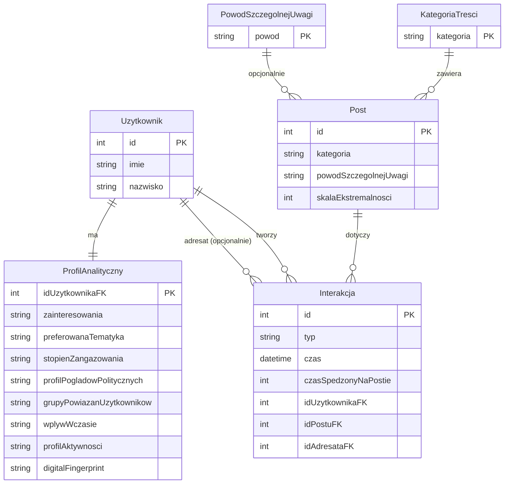
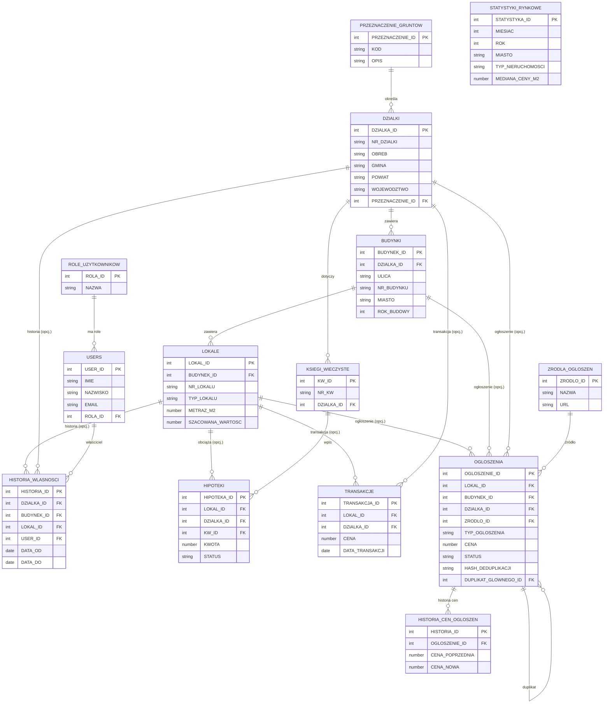

# PEGASUS + OBDN – Projekt bazy danych

Dwa niezależne systemy baz danych:

- **PEGASUS** — System Analizy Behawioralnej Platformy Społecznościowej
- **OBDN** — Ogólnopolska Baza Danych Nieruchomości

Oba działają na Oracle 21c (lokalnie przez Docker XE, produkcyjnie przez Oracle Autonomous Database).

---

## Tech Stack

<div align="center">

         

</div>

---

## Struktura projektu

```
.
├── setup.ps1                   ← jednoklokowe wdrożenie Windows (PEGASUS + OBDN)
├── setup.sh                    ← jednoklokowe wdrożenie Linux/macOS (PEGASUS + OBDN)
├── docker-compose.yml          ← Oracle XE + CloudBeaver
│
├── pegasus/
│   ├── analysis/
│   │   ├── Analiza biznesowa UML.md
│   │   ├── Algorytm analizy behawioralnej UML.md
│   │   ├── Model ERD.md
│   │   └── PEGASUSownik.md
│   ├── diagrams/
│   │   ├── 01_use_case.puml
│   │   ├── 02_activity_profile_calc.puml
│   │   ├── 03_activity_user_interaction.puml
│   │   ├── 04_state_user.puml
│   │   └── 05_erd.puml
│   ├── sql/
│   │   ├── 00_setup_schema.sql           ← użytkownik PEGASUS (lokalnie / XE)
│   │   ├── 01_create_tables.sql
│   │   ├── 02_insert_test_data.sql
│   │   ├── 03_views_and_procedures.sql
│   │   └── 04_demo_data.sql
│   └── tests/
│       ├── test_database.py
│       └── requirements.txt
│
└── obdn/
    ├── analysis/
    │   ├── Analiza biznesowa UML.md
    │   ├── Algorytm systemu UML.md
    │   ├── Model ERD.md
    │   └── Opis założeń.md
    ├── diagrams/
    │   ├── 01_use_case.puml
    │   ├── 02_activity_wyszukiwanie.puml
    │   ├── 03_activity_ogloszenie.puml
    │   ├── 04_state_ogloszenie.puml
    │   └── 05_erd.puml
    ├── sql/
    │   ├── 00_setup_schema.sql           ← użytkownik OBDN (lokalnie / XE)
    │   ├── 01_create_tables.sql
    │   ├── 02_insert_test_data.sql
    │   ├── 03_views_and_procedures.sql
    │   └── 04_demo_data.sql
    └── tests/
        ├── test_database.py
        └── requirements.txt
```

---

## PEGASUS — System Analizy Behawioralnej

Moduł analityczny osadzony w istniejącej platformie społecznościowej. Zbiera dane o interakcjach użytkowników z treściami (polubienia, komentarze, udostępnienia, czas oglądania) i buduje automatycznie profil behawioralny każdego użytkownika:

- preferowana tematyka treści,
- wskaźnik zaangażowania,
- profil poglądów politycznych,
- ekspozycja na treści ekstremistyczne,
- potencjalne grupy powiązań między użytkownikami (klastry).

### Model ERD (PEGASUS)



### Tabele (PEGASUS)

| Tabela                      | Opis                                                        |
| --------------------------- | ----------------------------------------------------------- |
| `ROLES`                     | Role użytkowników (`Admin`, `UzytkownikWidok`)              |
| `POST_CATEGORIES`           | Słownik kategorii treści (z flagą polityczną i kierunkiem)  |
| `SPECIAL_ATTENTION_REASONS` | Słownik powodów szczególnej uwagi (skala 1–5)               |
| `USERS`                     | Użytkownicy (imię, nazwisko, e-mail, status, rola)          |
| `POSTS`                     | Posty (autor, kategoria, powód uwagi, skala ekstremalności) |
| `LIKES`                     | Polubienia (user → post, czas spędzony)                     |
| `COMMENTS`                  | Komentarze (user → post, treść, czas spędzony)              |
| `SHARES`                    | Udostępnienia (from_user → post → to_user, czas spędzony)   |
| `POST_VIEWS`                | Sesje oglądania postów (czas start/end)                     |
| `USER_PROFILES`             | Profile behawioralne użytkowników (1:1 z `USERS`)           |

### Widoki (PEGASUS)

| Widok                       | Opis                                                                        |
| --------------------------- | --------------------------------------------------------------------------- |
| `V_USER_ACTIVITY`           | Sumaryczna aktywność użytkownika (lajki, komentarze, udostępnienia, widoki) |
| `V_USER_PREFERRED_CATEGORY` | Top-1 preferowana kategoria (ważone: lajk×1, komentarz×3, udostępnienie×2)  |
| `V_USER_POLITICAL_EXPOSURE` | Ekspozycja polityczna (LEFT / RIGHT / CENTER / EXTREMIST)                   |
| `V_FLAGGED_POSTS`           | Treści szczególnej uwagi (dla administratora)                               |
| `V_USER_FULL_PROFILE`       | Pełny profil behawioralny użytkownika (dla admina)                          |
| `V_MY_INTERACTIONS`         | Interakcje zalogowanego użytkownika                                         |

### Procedury (PEGASUS)

| Procedura                              | Opis                                                                                                                                                              |
| -------------------------------------- | ----------------------------------------------------------------------------------------------------------------------------------------------------------------- |
| `SP_CALCULATE_USER_PROFILE(p_user_id)` | Przelicza i zapisuje do `USER_PROFILES`: engagement score, profil aktywności, preferred category, political lean, extremism exposure, digital fingerprint SHA-256 |
| `SP_CALCULATE_ALL_PROFILES`            | Wywołuje `SP_CALCULATE_USER_PROFILE` dla wszystkich aktywnych użytkowników                                                                                        |
| `SP_BUILD_SOCIAL_CLUSTERS`             | Grupuje użytkowników w klastry społeczne na podstawie wspólnych kategorii                                                                                         |

---

## OBDN — Ogólnopolska Baza Danych Nieruchomości

Rejestr nieruchomości spinający w jedno dane z EGIB, EKW, TERYT i CEEB oraz ogłoszenia z zewnętrznych portali (Otodom, OLX, Gratka, Morizon). Trzypoziomowa hierarchia: działka → budynek → lokal. Role: Admin, Obywatel, Agent, Deweloper, Urzędnik, Bank, Analityk.

### Model ERD (OBDN)



### Tabele (OBDN)

| Tabela                  | Opis                                                              |
| ----------------------- | ----------------------------------------------------------------- |
| `ROLE_UZYTKOWNIKOW`     | Role: ADMIN, OBYWATEL, AGENT, DEWELOPER, URZEDNIK, BANK, ANALITYK |
| `PRZEZNACZENIE_GRUNTOW` | Slownik przeznaczeń gruntów (MN, MW, U, R, ZL)                    |
| `ZRODLA_OGLOSZEN`       | Portale ogłoszeniowe (Otodom, OLX, Gratka, Morizon, OBDN)         |
| `USERS`                 | Użytkownicy systemu (imię, nazwisko, e-mail, rola)                |
| `DZIALKI`               | Działki gruntu (numer, obreb, gmina, powiat, województwo)         |
| `BUDYNKI`               | Budynki (adres, rok budowy, liczba kondygnacji, źródło CEEB)      |
| `LOKALE`                | Lokale/mieszkania (typ, metraz, kondygnacja, szacowana wartość)   |
| `KSIEGI_WIECZYSTE`      | Księgi wieczyste EKW (numer, sad, data wpisu)                     |
| `HISTORIA_WLASNOSCI`    | Historia własności (kto, co, kiedy — polimorficzne FK)            |
| `HIPOTEKI`              | Hipoteki (kwota, wierzyciel, status, data wygaśnięcia)            |
| `TRANSAKCJE`            | Transakcje rynkowe (cena, data, typ, źródło EGIB)                 |
| `OGLOSZENIA`            | Ogłoszenia z portali (cena, status, hash deduplikacji, duplikat)  |
| `HISTORIA_CEN_OGLOSZEN` | Historia zmian cen ogłoszeń                                       |
| `STATYSTYKI_RYNKOWE`    | Statystyki rynku (mediana, min/max ceny/m2, liczba ofert)         |

### Widoki (OBDN)

- `V_OGLOSZENIA_AKTYWNE` — aktywne oferty z adresem i danymi wystawiającego
- `V_HISTORIA_WLASNOSCI_PELNA` — pełna historia właścicieli z adresem nieruchomości
- `V_HIPOTEKI_AKTYWNE` — aktywne hipoteki
- `V_STATYSTYKI_RYNKOWE_SUMMARY` — statystyki per miasto/typ/rok
- `V_DUPLIKATY_OGLOSZEN` — ogłoszenia zdeduplikowane (to samo mieszkanie na kilku portalach)
- `V_PORTFEL_AGENTA` — aktywne ogłoszenia agenta

### Procedury (OBDN)

`SP_SZACUJ_WARTOSC_LOKALU(p_lokal_id)` — liczy szacunkową wartość przez medianę ceny/m² z transakcji z ostatnich 12 miesięcy w tym samym mieście.

`SP_DEDUPLIKUJ_OGLOSZENIA` — SHA-256 hash na podstawie id nieruchomości + typ ogłoszenia; oznacza duplikaty między portalami.

`SP_OBLICZ_STATYSTYKI_RYNKOWE(p_miasto, p_rok, p_miesiac)` — MERGE do tabeli statystyk (COUNT, AVG, MEDIAN, MIN, MAX ceny/m²).

---

## Uruchamianie lokalnie (Docker + Oracle XE)

### Wymagania

- [Docker Desktop](https://www.docker.com/products/docker-desktop/) (Windows / macOS / Linux)

### Szybki start (jeden klik)

**Windows (PowerShell):**

```powershell
.\setup.ps1
```

**Linux / macOS (bash):**

```bash
bash setup.sh
```

Skrypt automatycznie:

1. Uruchamia kontener Oracle XE i CloudBeaver,
2. Czeka na gotowość bazy (do 5 minut),
3. Tworzy schemat `PEGASUS` → ładuje wszystkie skrypty SQL,
4. Tworzy schemat `OBDN` → ładuje wszystkie skrypty SQL.

Hasła są generowane losowo przy pierwszym uruchomieniu i zapisywane do `.env`:

```
ORACLE_PASSWORD=<hasło SYS>
PEGASUS_PASSWORD=<hasło użytkownika PEGASUS>
OBDN_PASSWORD=<hasło użytkownika OBDN>
```

Opcje:

| Flaga / opcja               | Opis                                   |
| --------------------------- | -------------------------------------- |
| `-Reset` / `--reset`        | Usuwa i odtwarza oba schematy od zera  |
| `-SkipData` / `--skip-data` | Tylko DDL, bez danych testowych i demo |

### Dane połączenia

**PEGASUS:**

| Parametr     | Wartość                                 |
| ------------ | --------------------------------------- |
| Host         | `localhost`                             |
| Port         | `1522`                                  |
| Service name | `XEPDB1`                                |
| Użytkownik   | `PEGASUS`                               |
| Hasło        | _(wartość `PEGASUS_PASSWORD` z `.env`)_ |

**OBDN:**

| Parametr     | Wartość                              |
| ------------ | ------------------------------------ |
| Host         | `localhost`                          |
| Port         | `1522`                               |
| Service name | `XEPDB1`                             |
| Użytkownik   | `OBDN`                               |
| Hasło        | _(wartość `OBDN_PASSWORD` z `.env`)_ |

### Panel administracyjny (CloudBeaver)

Po uruchomieniu: **http://localhost:8978**

Pierwsze uruchomienie poprosi o założenie lokalnego konta admina.  
Następnie dodaj dwa osobne połączenia (PEGASUS i OBDN):

| Parametr     | PEGASUS                     | OBDN                        |
| ------------ | --------------------------- | --------------------------- |
| Driver       | Oracle                      | Oracle                      |
| Host         | `oracle-xe`                 | `oracle-xe`                 |
| Port         | `1521`                      | `1521`                      |
| Database     | `XEPDB1`                    | `XEPDB1`                    |
| Service type | **Service Name** (nie SID!) | **Service Name** (nie SID!) |
| Użytkownik   | `PEGASUS`                   | `OBDN`                      |
| Hasło        | _(z `.env`)_                | _(z `.env`)_                |

> Jako hosta wpisuj `oracle-xe` (nazwa kontenera w sieci Dockera), nie `localhost`.

### Zatrzymanie / reset

```bash
# Zatrzymaj kontenery (dane zachowane)
docker compose down

# Pełny reset obu schematów
docker compose down -v
.\setup.ps1 -Reset      # Windows
bash setup.sh --reset   # Linux/macOS
```

---

## Testy integracyjne (CI)

Każdy schemat ma osobny suite testów w Pythonie (`oracledb` + `pytest`).  
Fixture `setup_database` automatycznie tworzy schemat i ładuje SQL — testy można uruchomić na czystym Oracle XE.

```bash
# PEGASUS
pip install -r pegasus/tests/requirements.txt
ORACLE_SYS_PASSWORD=... PEGASUS_PASSWORD=... pytest pegasus/tests/test_database.py -v

# OBDN
pip install -r obdn/tests/requirements.txt
ORACLE_SYS_PASSWORD=... OBDN_PASSWORD=... pytest obdn/tests/test_database.py -v
```

GitHub Actions uruchamia oba suite równolegle przy każdym push do `pegasus/sql/**` lub `obdn/sql/**`.

---

## Kolejność skryptów SQL (Oracle Autonomous Database / chmura)

**PEGASUS** — jako użytkownik `ADMIN`:

```sql
@pegasus/sql/01_create_tables.sql
@pegasus/sql/02_insert_test_data.sql
@pegasus/sql/03_views_and_procedures.sql
@pegasus/sql/04_demo_data.sql
```

**OBDN** — najpierw utwórz użytkownika `OBDN` jako `ADMIN`, potem jako `OBDN`:

```sql
-- jako ADMIN: utwórz użytkownika OBDN i nadaj uprawnienia
@obdn/sql/00_setup_schema.sql

-- jako OBDN:
@obdn/sql/01_create_tables.sql
@obdn/sql/02_insert_test_data.sql
@obdn/sql/03_views_and_procedures.sql
@obdn/sql/04_demo_data.sql
```

---

## Podział pracy

| Osoba | Zakres                                                      |
| ----- | ----------------------------------------------------------- |
| **1** | Analiza biznesowa, diagramy przypadków użycia, opis założeń |
| **2** | Model ERD, słowniki, decyzje projektowe                     |
| **3** | Diagramy czynności i stanów, widoki SQL                     |
| **4** | DDL/DML, procedury, Docker, CI, demo                        |

---

## Konwencje Git

```
main                              ← gałąź produkcyjna
    feat/pegasus-analiza-biznesowa
    feat/pegasus-erd-model
    feat/pegasus-oracle-wdrozenie
    feat/obdn-analiza-biznesowa
    feat/obdn-erd-model
    feat/obdn-oracle-wdrozenie
```

Każda osoba pracuje na swojej gałęzi feature i otwiera Pull Request do `main` po zakończeniu zadania.
