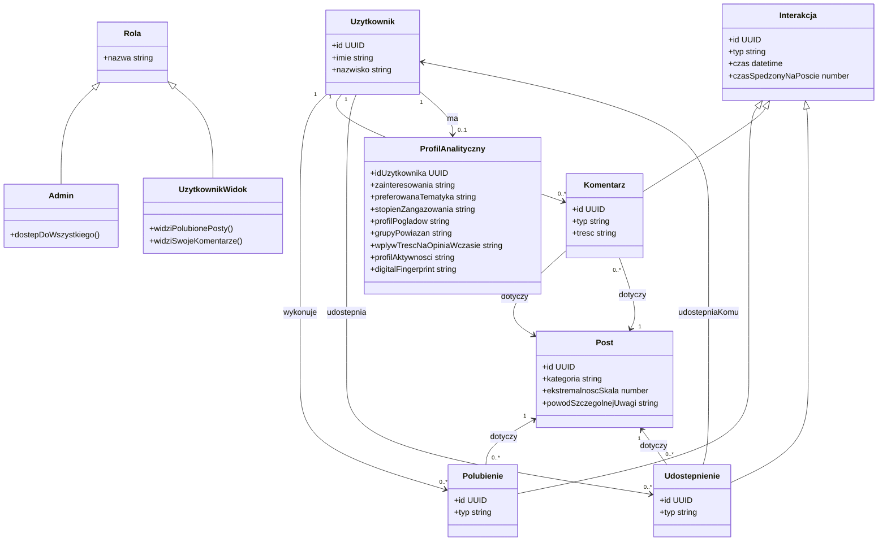

# Algorytm analizy behawioralnej UML

```mermaid
classDiagram
  %% PEGASUSownik - UML (analiza biznesowa i behawioralna dla bazy danych)

  class Uzytkownik {
    +id UUID
    +imie string
    +nazwisko string
  }

  class Post {
    +id UUID
    +kategoria string
    +ekstremalnoscSkala number
    +powodSzczegolnejUwagi string
  }

  class Interakcja {
    +id UUID
    +typ string
    +czas datetime
    +czasSpedzonyNaPoscie number
  }

  class Polubienie {
    +id UUID
    +typ string
  }

  class Komentarz {
    +id UUID
    +typ string
    +tresc string
  }

  class Udostepnienie {
    +id UUID
    +typ string
  }

  class ProfilAnalityczny {
    +idUzytkownika UUID
    +zainteresowania string
    +preferowanaTematyka string
    +stopienZangazowania string
    +profilPogladow string
    +grupyPowiazan string
    +wplywTrescNaOpiniaWczasie string
    +profilAktywnosci string
    +digitalFingerprint string
  }

  class Rola {
    +nazwa string
  }

  class Admin {
    +dostepDoWszystkiego()
  }

  class UzytkownikWidok {
    +widziPolubionePosty()
    +widziSwojeKomentarze()
  }

  %% Relationships
  Uzytkownik "1" --> "0..*" Polubienie : wykonuje
  Uzytkownik "1" --> "0..*" Komentarz : pisze
  Uzytkownik "1" --> "0..*" Udostepnienie : udostepnia

  Post "1" <-- "0..*" Polubienie : dotyczy
  Post "1" <-- "0..*" Komentarz : dotyczy
  Post "1" <-- "0..*" Udostepnienie : dotyczy

  Komentarz --> Post : dotyczy
  Udostepnienie --> Uzytkownik : udostepniaKomu

  %% Interakcje as specializations
  Interakcja <|-- Polubienie
  Interakcja <|-- Komentarz
  Interakcja <|-- Udostepnienie

  %% Profile
  Uzytkownik "1" --> "0..1" ProfilAnalityczny : ma

  %% Roles access
  Rola <|-- Admin
  Rola <|-- UzytkownikWidok
```
