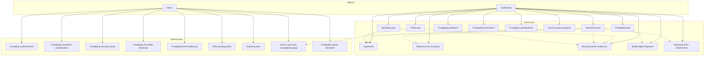

# Analiza biznesowa UML

```mermaid
flowchart TD
subgraph Aktorzy
A1[Admin]
A2[Użytkownik]
end

subgraph AdminCases
U1[Zarządzaj użytkownikami]
U2[Przeglądaj wszystkich użytkowników]
U3[Przeglądaj wszystkie posty]
U4[Przeglądaj wszystkie interakcje]
U5[Przeglądaj profil analityczny]
U6[Filtruj według profilu]
U7[Eksportuj dane]
U8[Oznacz post jako szczególnej uwagi]
U9[Przeglądaj raporty ostrzeżeń]
end

subgraph UserCases
U10[Logowanie]
U11[Przeglądaj feed]
U12[Polub post]
U13[Skomentuj post]
U14[Udostępnij post]
U15[Przeglądaj polubione]
U16[Przeglądaj komentarze]
U17[Przeglądaj udostępnienia]
U18[Rejestruj czas na poście]
U19[Aktualizuj profil analityczny]
U20[Buduj digital fingerprint]
U21[Wykrywaj treści ekstremalne]
U22[Generuj grupy powiązań]
end

%% Aktorzy do przypadków
A1 --> U1 & U2 & U3 & U4 & U5 & U6 & U7 & U8 & U9
A2 --> U10 & U11 & U12 & U13 & U14 & U15 & U16 & U17 & U18 & U19 & U20 & U21 & U22

%% Include
U13 -.-> U10
U14 -.-> U10
U12 -.-> U10
U12 -.-> U19
U13 -.-> U19
U14 -.-> U19
U11 -.-> U18

%% Extend
U11 -.-> U20
U13 -.-> U21
U13 -.-> U8
```
