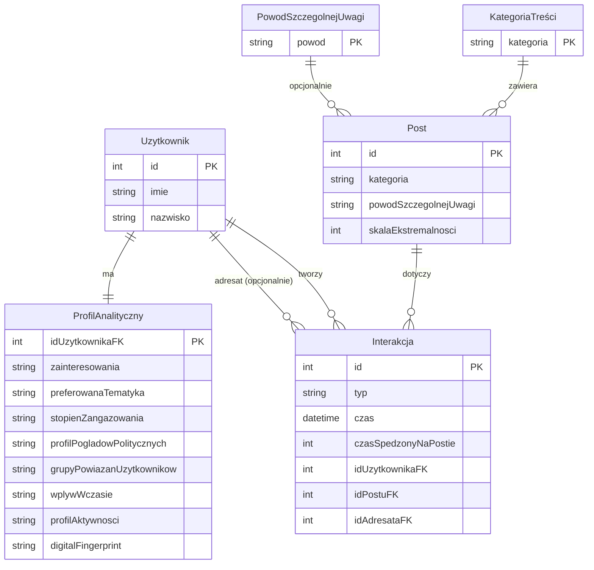

# Model ERD

```mermaid
erDiagram
  Uzytkownik {
    int id PK
    string imie
    string nazwisko
  }

  Post {
    int id PK
    string kategoria
    string powodSzczegolnejUwagi
    int skalaEkstremalnosci
  }

  Interakcja {
    int id PK
    string typ
    datetime czas
    int czasSpedzonyNaPostie
    int idUzytkownikaFK
    int idPostuFK
    int idAdresataFK
  }

  ProfilAnalityczny {
    int idUzytkownikaFK PK
    string zainteresowania
    string preferowanaTematyka
    string stopienZangazowania
    string profilPogladowPolitycznych
    string grupyPowiazanUzytkownikow
    string wplywWczasie
    string profilAktywnosci
    string digitalFingerprint
  }

  KategoriaTreści {
    string kategoria PK
  }

  PowodSzczegolnejUwagi {
    string powod PK
  }

  KategoriaTreści ||--o{ Post : "zawiera"
  PowodSzczegolnejUwagi ||--o{ Post : "opcjonalnie"
  Uzytkownik ||--o{ Interakcja : "tworzy"
  Post ||--o{ Interakcja : "dotyczy"
  Uzytkownik ||--o{ Interakcja : "adresat (opcjonalnie)"
  Uzytkownik ||--|| ProfilAnalityczny : "ma"
```
