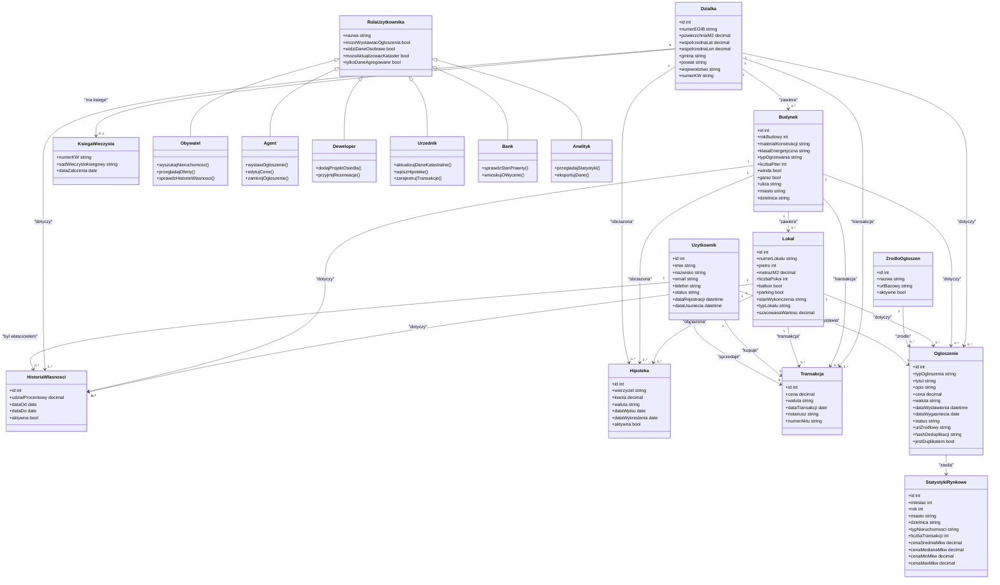

# Algorytm systemu UML

```mermaid
classDiagram
  %% OBDN – UML klas systemu

  class RolaUzytkownika {
    +nazwa string
    +mozeWystawiacOgloszenia bool
    +widziDaneOsobowe bool
    +mozeAktualizowacKataster bool
    +tylkoDaneAgregowane bool
  }

  class Uzytkownik {
    +id int
    +imie string
    +nazwisko string
    +email string
    +telefon string
    +status string
    +dataRejestracji datetime
    +dataUsuniecia datetime
  }

  class Dzialka {
    +id int
    +numerEGIB string
    +powierzchniaM2 decimal
    +wspolrzednaLat decimal
    +wspolrzednaLon decimal
    +gmina string
    +powiat string
    +wojewodztwo string
    +numerKW string
  }

  class Budynek {
    +id int
    +rokBudowy int
    +materialKonstrukcji string
    +klasaEnergetyczna string
    +typOgrzewania string
    +liczbaPiter int
    +winda bool
    +garaz bool
    +ulica string
    +miasto string
    +dzielnica string
  }

  class Lokal {
    +id int
    +numerLokalu string
    +pietro int
    +metrazM2 decimal
    +liczbaPokoi int
    +balkon bool
    +parking bool
    +stanWykonczenia string
    +typLokalu string
    +szacowanaWartosc decimal
  }

  class KsiegaWieczysta {
    +numerKW string
    +sadWieczystoksiegowy string
    +dataZalozenia date
  }

  class HistoriaWlasnosci {
    +id int
    +udzialProcentowy decimal
    +dataOd date
    +dataDo date
    +aktywna bool
  }

  class Hipoteka {
    +id int
    +wierzyciel string
    +kwota decimal
    +waluta string
    +dataWpisu date
    +dataWykreslenia date
    +aktywna bool
  }

  class Transakcja {
    +id int
    +cena decimal
    +waluta string
    +dataTransakcji date
    +notariusz string
    +numerAktu string
  }

  class Ogloszenie {
    +id int
    +typOgloszenia string
    +tytul string
    +opis string
    +cena decimal
    +waluta string
    +dataWystawienia datetime
    +dataWygasniecia date
    +status string
    +urlZrodlowy string
    +hashDeduplikacji string
    +jestDuplikatem bool
  }

  class ZrodloOgloszen {
    +id int
    +nazwa string
    +urlBazowy string
    +aktywne bool
  }

  class StatystykiRynkowe {
    +id int
    +miesiac int
    +rok int
    +miasto string
    +dzielnica string
    +typNieruchomosci string
    +liczbaTransakcji int
    +cenaSredniaMkw decimal
    +cenaMedianaMkw decimal
    +cenaMinMkw decimal
    +cenaMaxMkw decimal
  }

  class Obywatel {
    +wyszukajNieruchomosc()
    +przegladajOferty()
    +sprawdzHistorieWlasnosci()
  }

  class Agent {
    +wystawOgloszenie()
    +edytujCene()
    +zamknijOgloszenie()
  }

  class Deweloper {
    +dodajProjektOsiedla()
    +przyjmijRezerwacje()
  }

  class Urzednik {
    +aktualizujDaneKatastralne()
    +wpiszHipoteke()
    +zarejestrujTransakcje()
  }

  class Bank {
    +sprawdzStanPrawny()
    +wnioskujOWycene()
  }

  class Analityk {
    +przegladajStatystyki()
    +eksportujDane()
  }

  %% Hierarchia ról
  RolaUzytkownika <|-- Obywatel
  RolaUzytkownika <|-- Agent
  RolaUzytkownika <|-- Deweloper
  RolaUzytkownika <|-- Urzednik
  RolaUzytkownika <|-- Bank
  RolaUzytkownika <|-- Analityk

  %% Relacje użytkownik–własność
  Uzytkownik "1" --> "0..*" HistoriaWlasnosci : "byl wlascicielem"
  Uzytkownik "1" --> "0..*" Ogloszenie : "wystawia"
  Uzytkownik "1" --> "0..*" Transakcja : "sprzedaje"
  Uzytkownik "1" --> "0..*" Transakcja : "kupuje"

  %% Hierarchia nieruchomosci
  Dzialka "1" --> "0..*" Budynek : "zawiera"
  Budynek "1" --> "0..*" Lokal : "zawiera"
  Dzialka "1" --> "0..1" KsiegaWieczysta : "ma ksiege"

  %% Własność i obciążenia (wielopoziomowe)
  Dzialka "1" --> "0..*" HistoriaWlasnosci : "dotyczy"
  Budynek "1" --> "0..*" HistoriaWlasnosci : "dotyczy"
  Lokal "1" --> "0..*" HistoriaWlasnosci : "dotyczy"

  Dzialka "1" --> "0..*" Hipoteka : "obciazona"
  Budynek "1" --> "0..*" Hipoteka : "obciazona"
  Lokal "1" --> "0..*" Hipoteka : "obciazona"

  Lokal "1" --> "0..*" Transakcja : "transakcja"
  Budynek "1" --> "0..*" Transakcja : "transakcja"
  Dzialka "1" --> "0..*" Transakcja : "transakcja"

  %% Ogłoszenia
  ZrodloOgloszen "1" --> "0..*" Ogloszenie : "zrodlo"
  Lokal "1" --> "0..*" Ogloszenie : "dotyczy"
  Budynek "1" --> "0..*" Ogloszenie : "dotyczy"
  Dzialka "1" --> "0..*" Ogloszenie : "dotyczy"
  Ogloszenie --> StatystykiRynkowe : "zasila"
```
