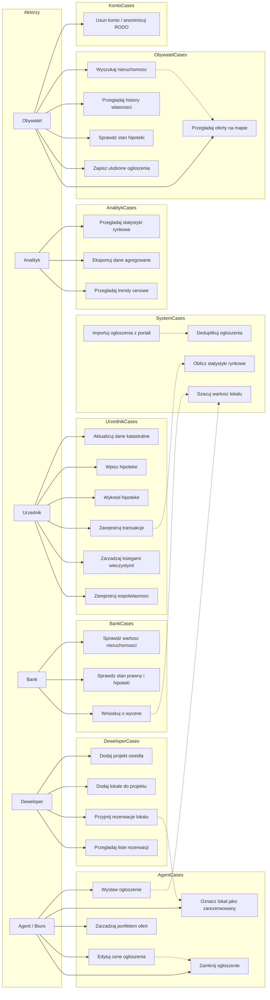

# Analiza biznesowa UML

```mermaid
flowchart LR
subgraph Aktorzy
A1[Obywatel]
A2[Agent / Biuro]
A3[Deweloper]
A4[Urzednik]
A5[Bank]
A6[Analityk]
end

subgraph ObywatelCases
U1[Wyszukaj nieruchomosc]
U2[Przegladaj oferty na mapie]
U3[Przegladaj history wlasnosci]
U4[Sprawdz stan hipoteki]
U5[Zapisz ulubione ogloszenia]
end

subgraph AgentCases
U6[Wystaw ogloszenie]
U7[Edytuj cene ogloszenia]
U8[Zarzadzaj portfelem ofert]
U9[Oznacz lokal jako zarezerwowany]
U10[Zamknij ogloszenie]
end

subgraph DeweloperCases
U11[Dodaj projekt osiedla]
U12[Dodaj lokale do projektu]
U13[Przyjmij rezerwacje lokalu]
U14[Przegladaj liste rezerwacji]
end

subgraph UrzednikCases
U15[Aktualizuj dane katastralne]
U16[Wpisz hipoteke]
U17[Wykresl hipoteke]
U18[Zarejestruj transakcje]
U19[Zarzadzaj ksiegami wieczystymi]
U31[Zarejestruj wspolwlasnosc]
end

subgraph BankCases
U20[Sprawdz wartosc nieruchomosci]
U21[Sprawdz stan prawny i hipoteki]
U22[Wnioskuj o wycene]
end

subgraph AnalitykCases
U23[Przegladaj statystyki rynkowe]
U24[Eksportuj dane agregowane]
U25[Przegladaj trendy cenowe]
end

subgraph SystemCases
U26[Importuj ogloszenia z portali]
U27[Deduplikuj ogloszenia]
U28[Oblicz statystyki rynkowe]
U29[Szacuj wartosc lokalu]
end

subgraph KontoCases
U30[Usun konto / anonimizuj RODO]
end

%% Aktorzy do przypadkow
A1 --> U1 & U2 & U3 & U4 & U5 & U30
A2 --> U6 & U7 & U8 & U9 & U10
A3 --> U11 & U12 & U13 & U14
A4 --> U15 & U16 & U17 & U18 & U19 & U31
A5 --> U20 & U21 & U22
A6 --> U23 & U24 & U25

%% Include
U1 -.-> U2
U6 -.-> U29
U18 -.-> U28
U26 -.-> U27

%% Extend
U7 -.-> U10
U13 -.-> U9
U22 -.-> U29
```
