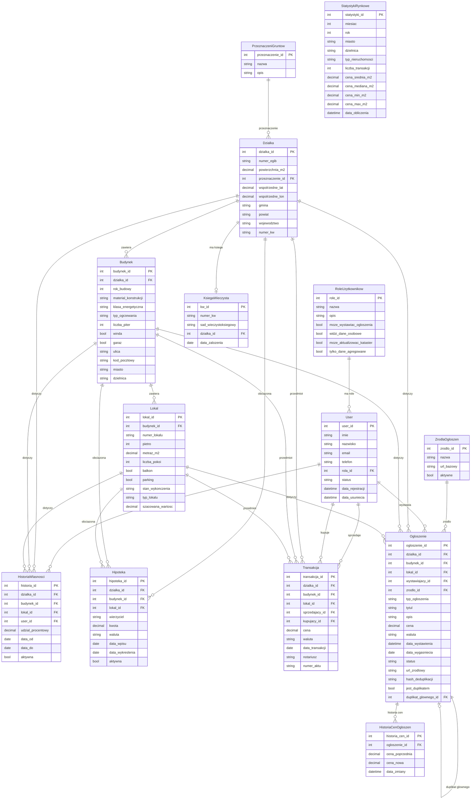

# Model ERD

```mermaid
erDiagram
  RoleUzytkownikow {
    int role_id PK
    string nazwa
    string opis
    bool moze_wystawiac_ogloszenia
    bool widzi_dane_osobowe
    bool moze_aktualizowac_kataster
    bool tylko_dane_agregowane
  }

  User {
    int user_id PK
    string imie
    string nazwisko
    string email
    string telefon
    int rola_id FK
    string status
    datetime data_rejestracji
    datetime data_usuniecia
  }

  PrzeznaczeniGruntow {
    int przeznaczenie_id PK
    string nazwa
    string opis
  }

  Dzialka {
    int dzialka_id PK
    string numer_egib
    decimal powierzchnia_m2
    int przeznaczenie_id FK
    decimal wspolrzedne_lat
    decimal wspolrzedne_lon
    string gmina
    string powiat
    string wojewodztwo
    string numer_kw
  }

  Budynek {
    int budynek_id PK
    int dzialka_id FK
    int rok_budowy
    string material_konstrukcji
    string klasa_energetyczna
    string typ_ogrzewania
    int liczba_piter
    bool winda
    bool garaz
    string ulica
    string kod_pocztowy
    string miasto
    string dzielnica
  }

  Lokal {
    int lokal_id PK
    int budynek_id FK
    string numer_lokalu
    int pietro
    decimal metraz_m2
    int liczba_pokoi
    bool balkon
    bool parking
    string stan_wykonczenia
    string typ_lokalu
    decimal szacowana_wartosc
  }

  KsiegaWieczysta {
    int kw_id PK
    string numer_kw
    string sad_wieczystoksiegowy
    int dzialka_id FK
    date data_zalozenia
  }

  HistoriaWlasnosci {
    int historia_id PK
    int dzialka_id FK
    int budynek_id FK
    int lokal_id FK
    int user_id FK
    decimal udzial_procentowy
    date data_od
    date data_do
    bool aktywna
  }

  Hipoteka {
    int hipoteka_id PK
    int dzialka_id FK
    int budynek_id FK
    int lokal_id FK
    string wierzyciel
    decimal kwota
    string waluta
    date data_wpisu
    date data_wykreslenia
    bool aktywna
  }

  Transakcja {
    int transakcja_id PK
    int dzialka_id FK
    int budynek_id FK
    int lokal_id FK
    int sprzedajacy_id FK
    int kupujacy_id FK
    decimal cena
    string waluta
    date data_transakcji
    string notariusz
    string numer_aktu
  }

  ZrodlaOgloszen {
    int zrodlo_id PK
    string nazwa
    string url_bazowy
    bool aktywne
  }

  Ogloszenie {
    int ogloszenie_id PK
    int dzialka_id FK
    int budynek_id FK
    int lokal_id FK
    int wystawiajacy_id FK
    int zrodlo_id FK
    string typ_ogloszenia
    string tytul
    string opis
    decimal cena
    string waluta
    datetime data_wystawienia
    date data_wygasniecia
    string status
    string url_zrodlowy
    string hash_deduplikacji
    bool jest_duplikatem
    int duplikat_glownego_id FK
  }

  HistoriaCenOgloszen {
    int historia_cen_id PK
    int ogloszenie_id FK
    decimal cena_poprzednia
    decimal cena_nowa
    datetime data_zmiany
  }

  StatystykiRynkowe {
    int statystyki_id PK
    int miesiac
    int rok
    string miasto
    string dzielnica
    string typ_nieruchomosci
    int liczba_transakcji
    decimal cena_srednia_m2
    decimal cena_mediana_m2
    decimal cena_min_m2
    decimal cena_max_m2
    datetime data_obliczenia
  }

  RoleUzytkownikow ||--o{ User : "ma role"

  PrzeznaczeniGruntow ||--o{ Dzialka : "przeznaczenie"
  Dzialka ||--o{ Budynek : "zawiera"
  Dzialka ||--o| KsiegaWieczysta : "ma ksiege"
  Budynek ||--o{ Lokal : "zawiera"

  User ||--o{ HistoriaWlasnosci : "byl wlascicielem"
  Dzialka ||--o{ HistoriaWlasnosci : "dotyczy"
  Budynek ||--o{ HistoriaWlasnosci : "dotyczy"
  Lokal ||--o{ HistoriaWlasnosci : "dotyczy"

  Dzialka ||--o{ Hipoteka : "obciazona"
  Budynek ||--o{ Hipoteka : "obciazona"
  Lokal ||--o{ Hipoteka : "obciazona"

  User ||--o{ Transakcja : "sprzedaje"
  User ||--o{ Transakcja : "kupuje"
  Dzialka ||--o{ Transakcja : "przedmiot"
  Budynek ||--o{ Transakcja : "przedmiot"
  Lokal ||--o{ Transakcja : "przedmiot"

  ZrodlaOgloszen ||--o{ Ogloszenie : "zrodlo"
  User ||--o{ Ogloszenie : "wystawia"
  Dzialka ||--o{ Ogloszenie : "dotyczy"
  Budynek ||--o{ Ogloszenie : "dotyczy"
  Lokal ||--o{ Ogloszenie : "dotyczy"
  Ogloszenie ||--o{ HistoriaCenOgloszen : "historia cen"
  Ogloszenie ||--o| Ogloszenie : "duplikat glownego"
```
