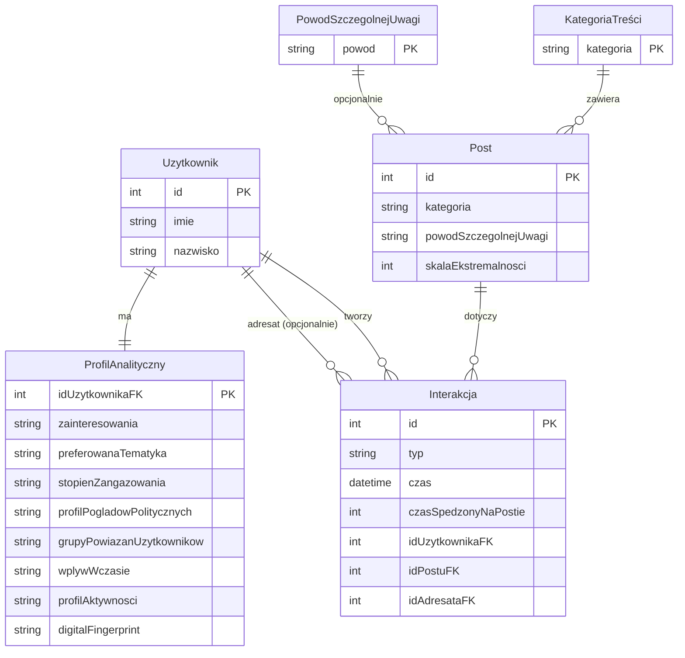
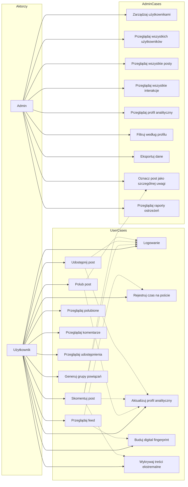
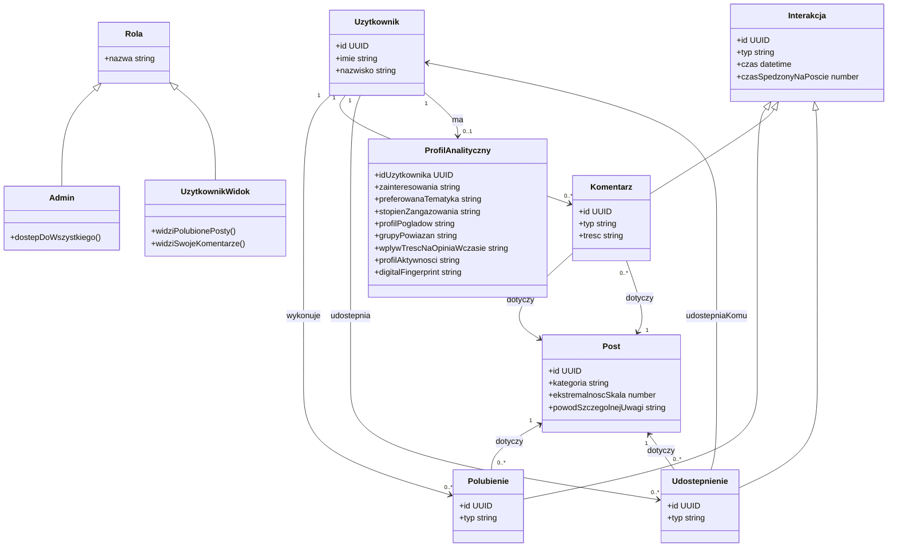

# PEGASUSownik

_System Analizy Behawioralnej Platformy Społecznościowej_

Projekt bazy danych dla klienta (grupa F).
Implementacja na Oracle Autonomous Database (Free Tier) — SQL Developer Web.

---

## Opis systemu

Moduł analityczny osadzony w istniejącej platformie społecznościowej.  
Zbiera dane o interakcjach użytkowników z treściami (polubienia, komentarze, udostępnienia, czas oglądania) i na ich podstawie automatycznie buduje profil behawioralny każdego użytkownika:

- preferowana tematyka treści,
- wskaźnik zaangażowania,
- profil poglądów politycznych,
- ekspozycja na treści ekstremistyczne,
- potencjalne grupy powiązań między użytkownikami (klastry).

---

## Struktura projektu

```
pegasus/
├── analysis/
│   ├── Analiza biznesowa UML.md          ← diagram przypadków użycia (Mermaid)
│   ├── Algorytm analizy behawioralnej UML.md  ← diagram klas UML (Mermaid)
│   ├── Model ERD.md                      ← diagram ERD (Mermaid)
│   └── PEGASUSownik.md                   ← opis koncepcji systemu
├── diagrams/
│   ├── 01_use_case.puml                  ← przypadki użycia (PlantUML)
│   ├── 02_activity_profile_calc.puml     ← czynności: obliczanie profilu
│   ├── 03_activity_user_interaction.puml ← czynności: interakcja użytkownika
│   ├── 04_state_user.puml                ← diagram stanów użytkownika
│   └── 05_erd.puml                       ← ERD (PlantUML)
└── sql/
    ├── 00_setup_schema.sql               ← tworzenie użytkownika PEGASUS (tylko lokalnie / XE)
    ├── 01_create_tables.sql              ← DDL: tabele, sekwencje, więzy
    ├── 02_insert_test_data.sql           ← dane testowe (słowniki + przykładowi użytkownicy)
    ├── 03_views_and_procedures.sql       ← widoki analityczne + procedury SP_CALCULATE_USER_PROFILE, SP_CALCULATE_ALL_PROFILES, SP_BUILD_SOCIAL_CLUSTERS
    └── 04_demo_data.sql                  ← dane demo na zajęcia
```

---

## Diagramy UML

### Model ERD



### Analiza biznesowa (przypadki użycia)



### Algorytm analizy behawioralnej (diagram klas)



---

## Schemat bazy danych

### Tabele

| Tabela                      | Opis                                                        |
| --------------------------- | ----------------------------------------------------------- |
| `ROLES`                     | Role użytkowników (`Admin`, `UzytkownikWidok`)              |
| `POST_CATEGORIES`           | Słownik kategorii treści (z flagą polityczną i kierunkiem)  |
| `SPECIAL_ATTENTION_REASONS` | Słownik powodów szczególnej uwagi (skala 1–5)               |
| `USERS`                     | Użytkownicy (imię, nazwisko, e-mail, status, rola)          |
| `POSTS`                     | Posty (autor, kategoria, powód uwagi, skala ekstremalności) |
| `LIKES`                     | Polubienia (user → post, czas spędzony)                     |
| `COMMENTS`                  | Komentarze (user → post, treść, czas spędzony)              |
| `SHARES`                    | Udostępnienia (from_user → post → to_user, czas spędzony)   |
| `POST_VIEWS`                | Sesje oglądania postów (czas start/end)                     |
| `USER_PROFILES`             | Profile behawioralne użytkowników (1:1 z `USERS`)           |

### Widoki analityczne

| Widok                       | Opis                                                                        |
| --------------------------- | --------------------------------------------------------------------------- |
| `V_USER_ACTIVITY`           | Sumaryczna aktywność użytkownika (lajki, komentarze, udostępnienia, widoki) |
| `V_USER_PREFERRED_CATEGORY` | Top-1 preferowana kategoria (ważone: lajk×1, komentarz×3, udostępnienie×2)  |
| `V_USER_POLITICAL_EXPOSURE` | Ekspozycja polityczna (LEFT / RIGHT / CENTER / EXTREMIST)                   |
| `V_FLAGGED_POSTS`           | Treści szczególnej uwagi (dla administratora)                               |
| `V_USER_FULL_PROFILE`       | Pełny profil behawioralny użytkownika (dla admina)                          |
| `V_USER_BEHAVIORAL_PROFILE` | Uproszczony profil behawioralny (publiczny)                                 |

### Procedury

`SP_CALCULATE_USER_PROFILE(p_user_id)` — przelicza i zapisuje do `USER_PROFILES`:

- `ENGAGEMENT_SCORE` i `ACTIVITY_PROFILE` (WYSOKA / SREDNIA / NISKA),
- `PREFERRED_CATEGORY_ID` i `PREFERRED_TOPICS`,
- `POLITICAL_LEAN` i `POLITICAL_SCORE`,
- `EXTREMISM_EXPOSURE_SCORE`,
- `OPINION_INFLUENCE_TIMELINE` (STABILNA / ROSNACA / MALEJACA),
- `DIGITAL_FINGERPRINT` (hash SHA-256 wzorca zachowania).

`SP_CALCULATE_ALL_PROFILES` — wywołuje `SP_CALCULATE_USER_PROFILE` dla wszystkich aktywnych użytkowników.

`SP_BUILD_SOCIAL_CLUSTERS` — grupuje użytkowników w klastry społeczne na podstawie wspólnych kategorii.

---

## Podział pracy

| Osoba | Zakres                                                                                          |
| ----- | ----------------------------------------------------------------------------------------------- |
| **1** | Analiza biznesowa, opis procesów, wymagania, diagram UML przypadków użycia                      |
| **2** | Model ERD, decyzje projektowe, słowniki kategorii i powodów                                     |
| **3** | Algorytm analizy behawioralnej, diagramy UML czynności i stanu, widoki SQL                      |
| **4** | Wdrożenie Oracle Cloud, skrypty DDL/DML, procedury, demo na zajęciach, materiały do prezentacji |

---

## Kolejność uruchamiania skryptów SQL

**Oracle Autonomous Database (chmura)** — jako użytkownik `ADMIN` w SQL Developer Web:

```sql
@01_create_tables.sql          -- tworzy tabele i sekwencje
@02_insert_test_data.sql       -- słowniki i dane testowe
@03_views_and_procedures.sql   -- widoki i procedury SP_CALCULATE_USER_PROFILE, SP_CALCULATE_ALL_PROFILES, SP_BUILD_SOCIAL_CLUSTERS
@04_demo_data.sql              -- dane demo
```

**Lokalnie (Docker + Oracle XE)** — patrz sekcja [Uruchamianie lokalnie](#uruchamianie-lokalnie-docker--oracle-xe):

```sql
-- Jako SYS:
@00_setup_schema.sql           -- tworzy użytkownika PEGASUS (jednorazowo)

-- Jako PEGASUS:
@01_create_tables.sql
@02_insert_test_data.sql
@03_views_and_procedures.sql
@04_demo_data.sql
```

---

## Uruchamianie lokalnie (Docker + Oracle XE)

Alternatywa dla Oracle Autonomous Database (chmura) — każdy może uruchomić bazę na swoim komputerze bez konta Oracle Cloud.

### Wymagania

- [Docker Desktop](https://www.docker.com/products/docker-desktop/) (Windows / macOS / Linux)

### Szybki start (jeden klik)

**Windows (PowerShell):**

```powershell
.\setup.ps1
```

**Linux / macOS (bash):**

```bash
bash setup.sh
```

Skrypt sam: uruchamia kontener Oracle XE, czeka na gotowość bazy, tworzy schemat `PEGASUS` i ładuje wszystkie dane testowe.

Hasła (domyślne w `.env`, zmień przed pierwszym użyciem):

```
ORACLE_PASSWORD=<hasło SYS>
PEGASUS_PASSWORD=<hasło użytkownika PEGASUS>
```

Opcje:

| Flaga / opcja               | Opis                                     |
| --------------------------- | ---------------------------------------- |
| `-Reset` / `--reset`        | Usuwa i odtwarza schemat PEGASUS od zera |
| `-SkipData` / `--skip-data` | Tylko DDL, bez danych testowych          |

### Dane połączenia (SQL Developer / DBeaver / inne narzędzia)

| Parametr     | Wartość                               |
| ------------ | ------------------------------------- |
| Host         | `localhost`                           |
| Port         | `1522`                                |
| Service name | `XEPDB1`                              |
| Użytkownik   | `PEGASUS`                             |
| Hasło        | _(wartość PEGASUS_PASSWORD z `.env`)_ |

> **SQL Developer**: wybierz typ połączenia _Basic_, wpisz powyższe dane.  
> **DBeaver**: sterownik _Oracle_, Service Name = `XEPDB1`.

### Panel administracyjny (CloudBeaver)

`docker compose up -d` uruchamia również **CloudBeaver** — przeglądarkowy interfejs do bazy.

Po uruchomieniu: **http://localhost:8978**

Pierwsze uruchomienie poprosi o założenie lokalnego konta admina (dowolny login/hasło).  
Następnie dodaj nowe połączenie:

| Parametr     | Wartość                               |
| ------------ | ------------------------------------- |
| Driver       | Oracle                                |
| Host         | `oracle-xe`                           |
| Port         | `1521`                                |
| Database     | `XEPDB1`                              |
| Service type | **Service Name** (nie SID!)           |
| Użytkownik   | `PEGASUS`                             |
| Hasło        | _(wartość PEGASUS_PASSWORD z `.env`)_ |

> Jako hosta wpisz `oracle-xe` (nazwa kontenera w sieci Dockera), nie `localhost`.  
> W sekcji MISC ustaw **Service type = Service Name** — `XEPDB1` to PDB (Pluggable Database), nie SID.

### Zatrzymanie / reset

```bash
# Zatrzymaj kontener (dane zachowane)
docker compose down

# Usuń kontener + dane (pełny reset)
docker compose down -v
```

---

## Konwencje Git

```
main                              ← zostawiamy bez zmian
pegasus                           ← wersja prezentacyjna (tylko merge przez PR)
    feat/analiza-biznesowa-UML
    feat/erd-model
    feat/analiza-behawioralna-UML
    feat/oracle-wdrozenie
```

Każda osoba pracuje na swojej gałęzi feature i otwiera Pull Request do `pegasus` po zakończeniu zadania.
