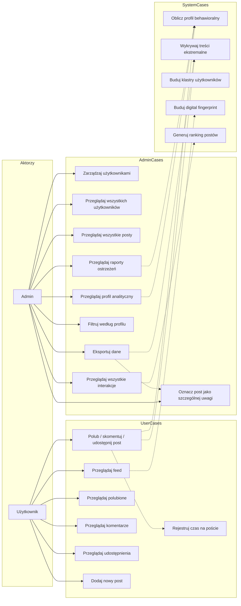

# Analiza biznesowa UML

```mermaid
flowchart LR
subgraph Aktorzy
A1[Admin]
A2[Użytkownik]
end

subgraph AdminCases
U1[Zarządzaj użytkownikami]
U2[Przeglądaj wszystkich użytkowników]
U3[Przeglądaj wszystkie posty]
U4[Przeglądaj wszystkie interakcje]
U5[Przeglądaj profil analityczny]
U6[Filtruj według profilu]
U7[Eksportuj dane]
U8[Oznacz post jako szczególnej uwagi]
U9[Przeglądaj raporty ostrzeżeń]
end

subgraph UserCases
U10[Przeglądaj feed]
U11[Polub / skomentuj / udostępnij post]
U12[Rejestruj czas na poście]
U13[Przeglądaj polubione]
U14[Przeglądaj komentarze]
U15[Przeglądaj udostępnienia]
U16[Dodaj nowy post]
end

subgraph SystemCases
U17[Oblicz profil behawioralny]
U18[Wykrywaj treści ekstremalne]
U19[Buduj klastry użytkowników]
U20[Buduj digital fingerprint]
U21[Generuj ranking postów]
end

%% Aktorzy do przypadków
A1 --> U1 & U2 & U3 & U4 & U5 & U6 & U7 & U8 & U9
A2 --> U10 & U11 & U13 & U14 & U15 & U16

%% Include
U11 -.-> U12
U11 -.-> U17
U5 -.-> U17
U7 -.-> U18
U9 -.-> U17

%% Extend
U10 -.-> U20
U11 -.-> U18
U7 -.-> U8
U4 -.-> U21
```
